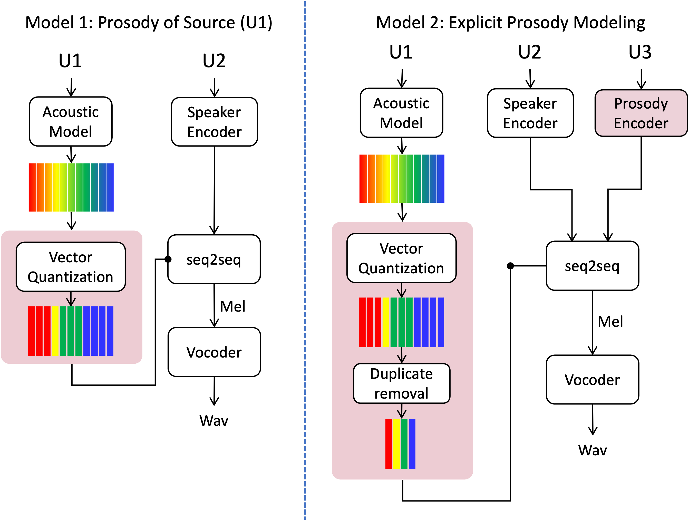

# Vector Quantized PPGs based Voice conversion

<!-- Code for this paper [Decoupling segmental and prosodic cues of non-native speech through vector quantization](https://www.isca-speech.org/archive/interspeech_2022/quamer22_interspeech.html)

Waris Quamer, Anurag Das, Ricardo Gutierrez-Osuna -->
## Block Diagram


See details here. [Link](https://anonymousis23.github.io/demos/prosody-accent-conversion/)

## Installation
1. Python 3.8
* Install [PyTorch](https://pytorch.org/get-started/locally/) (>=1.0.1).
* Install Nvidia version of [TensorFlow 1.15](https://github.com/NVIDIA/tensorflow)
* Install [ffmpeg](https://ffmpeg.org/download.html#get-packages).
* Install [Kaldi](https://github.com/kaldi-asr/kaldi)
* Install [PyKaldi](https://github.com/pykaldi/pykaldi)
* Run `pip install -r requirements.txt` to install the remaining necessary packages.
* Download pretrained [TDNN-F model](https://kaldi-asr.org/models/13/0013_librispeech_v1_chain.tar.gz), extract it, and set `PRETRAIN_ROOT` in `kaldi_scripts/extract_features_kaldi.sh` to the pretrained model directory.


## Dataset

* Acoustic Model: [LibriSpeech](https://www.openslr.org/12). Download pretrained TDNN-F acoustic model [here](https://kaldi-asr.org/models/13/0013_librispeech_v1_chain.tar.gz).
  * You also need to set `KALDI_ROOT` and `PRETRAIN_ROOT` in `kaldi_scripts/extract_features_kaldi.sh` accordingly.
* Speaker Encoder: [LibriSpeech](https://www.openslr.org/12), see [here](https://github.com/CorentinJ/Real-Time-Voice-Cloning) for detailed training process.
* Vector Quantization:  [[ARCTIC](http://www.festvox.org/cmu_arctic/) and [L2-ARCTIC](https://psi.engr.tamu.edu/l2-arctic-corpus/), see [here](https://github.com/warisqr007/vq-bnf) for detailed training process.
* Synthesizer (i.e., Seq2seq model): [ARCTIC](http://www.festvox.org/cmu_arctic/) and [L2-ARCTIC](https://psi.engr.tamu.edu/l2-arctic-corpus/). Please see [here]() for a merged version.
* Vocoder: [LibriSpeech](https://www.openslr.org/12), see [here](https://github.com/CorentinJ/Real-Time-Voice-Cloning) for detailed training process.

All the pretrained the models are available (To be updated) [here](https://drive.google.com/file/d/1RUFXQ9jVXTAgPSukUuWv0TGKGhuaQeeo/view?usp=sharing) 

## Quick Start

See [the inference script](inference_script.ipynb)

## Training

* Use Kaldi to extract BNF for the reference L1 speaker
```
./kaldi_scripts/extract_features_kaldi.sh /path/to/L2-ARCTIC/BDL
```
* Preprocessing
```
python synthesizer_preprocess_audio.py /path/to/L2-ARCTIC BDL /path/to/L2-ARCTIC/BDL/kaldi --out_dir=your_preprocess_output_dir
python synthesizer_preprocess_embeds.py your_preprocess_output_dir

python translator_preprocess_audio.py /path/to/L2-ARCTIC BDL /path/to/L2-ARCTIC/BDL/kaldi --out_dir=your_preprocess_output_dir
python translator_preprocess_embeds.py your_preprocess_output_dir
```
* Training
```
python translator_train.py PPG2PPG_train your_preprocess_output_dir
python synthesizer_train.py Accetron_train your_preprocess_output_dir
```